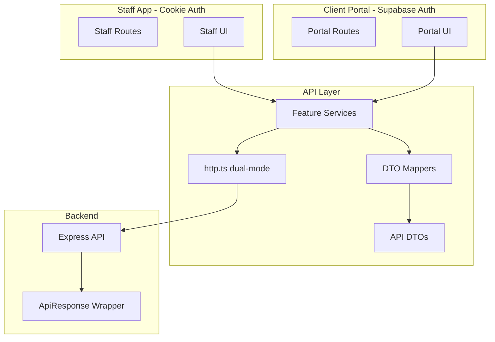

# Frontend Split-DB Migration Plan

## Non-Negotiable Contract With Backend

**In canonical mode (primary), backend returns the standardized wrapper:**

```typescript
// Success response (single item)
{ success: true, data: T, meta?: { ... } }

// Success response (list)
{ success: true, data: T[], meta: { count: number, total?: number, page?: number } }

// Error response  
{ success: false, error: string, code?: string }
```

**During bake/shadow period:**

- Backend may still return legacy response shapes (arrays, alternate wrappers)
- Frontend must support a temporary compatibility window via `VITE_USE_LEGACY_API`

**Frontend should NOT permanently support:**

- Mixed array vs `{data:[]}` responses
- Nested `user` objects in client responses
- Mixed snake_case/camelCase fields

These are **temporary compatibility layers only** during the bake period.

---

## Current State Analysis

The codebase has several issues that align with the migration document's concerns:

**API Layer Issues:**

- No centralized HTTP client - 13+ files with inline fetch calls
- 3 different base URL patterns across modules
- Inconsistent error handling and response parsing

**Type Duplication:**

- 5+ User type definitions across different files
- 3+ Client type definitions with different structures
- 3 different UserStatus enums (one missing 'customer')
- Mixed snake_case/camelCase field naming

**Data Transformation:**

- 70+ line flattening logic in [useClients.ts](src/common/hooks/clients/useClients.ts) (lines 48-117)
- Similar transformation in [doulaService.ts](src/api/doulas/doulaService.ts) (lines 311-351)
- Debug console.logs throughout

**Auth Issues:**

- Race conditions between backend and Supabase auth checks
- No separation between staff routes and client portal routes
- "Either auth" logic allows potential cross-access

---

## Architecture Overview




---

## Feature Flag Strategy

**REQUIRED: Compatibility Window Rule**

```typescript
// VITE_USE_LEGACY_API controls compatibility mode
const USE_LEGACY_API = import.meta.env.VITE_USE_LEGACY_API === 'true';
```


| Flag Value               | http.ts Behavior                                                            | Mapper Behavior                                                        |
| ------------------------ | --------------------------------------------------------------------------- | ---------------------------------------------------------------------- |
| `true` (legacy mode)     | Return raw JSON from fetch; do NOT require ApiResponse wrapper              | Accept legacy shapes: `[]`, `{data:[]}`, `{clients:[]}`, nested `user` |
| `false` (canonical mode) | **Fail fast** if response lacks `success` boolean field; unwrap ApiResponse | Accept canonical DTOs only; reject legacy shapes                       |


**Rollout Sync with Backend:**


| Backend `SPLIT_DB_READ_MODE` | Frontend `VITE_USE_LEGACY_API` |
| ---------------------------- | ------------------------------ |
| `shadow`                     | `true` (allow legacy)          |
| `primary` + DTOs stabilized  | `false` (enforce canonical)    |


**Critical Difference:**

- When `VITE_USE_LEGACY_API=true`: http client returns raw JSON, services/mappers handle format detection
- When `VITE_USE_LEGACY_API=false`: http client enforces ApiResponse wrapper, services receive unwrapped `T`

---

## Locked Endpoint Contract (Frontend Must Use These Only)


| Endpoint                                | Method | Auth          | Returns (Canonical)                           |
| --------------------------------------- | ------ | ------------- | --------------------------------------------- |
| `/auth/me`                              | GET    | Staff         | `UserDTO`                                     |
| `/clients`                              | GET    | Staff         | `ClientListItemDTO[]`                         |
| `/clients/:id`                          | GET    | Staff         | `ClientDetailDTO` (supports `?detailed=true`) |
| `/clients/status`                       | PUT    | Staff         | `ClientDetailDTO`                             |
| `/clients/:id/activities`               | GET    | Staff         | `ActivityDTO[]`                               |
| `/clients/:id/activity`                 | POST   | Staff         | `ActivityDTO`                                 |
| `/api/doulas/hours`                     | GET    | Staff (doula) | `HoursEntryDTO[]`                             |
| `/api/doulas/hours`                     | POST   | Staff (doula) | `HoursEntryDTO`                               |
| `/api/dashboard/stats`                  | GET    | Staff (admin) | `DashboardStatsDTO`                           |
| `/api/dashboard/calendar`               | GET    | Staff (admin) | `DashboardCalendarDTO[]`                      |
| `/api/admin/clients/:id/portal/invite`  | POST   | Staff (admin) | `PortalInviteDTO`                             |
| `/api/admin/clients/:id/portal/resend`  | POST   | Staff (admin) | `PortalInviteDTO`                             |
| `/api/admin/clients/:id/portal/disable` | POST   | Staff (admin) | `PortalStatusDTO`                             |


**Explicitly NOT assumed (per backend choice - Option A):**

- `GET /clients/me/portal-status` - Backend has NOT committed to this endpoint
- Portal status updates come from admin endpoints only
- `PortalStatusDTO` is returned from `POST /api/admin/clients/:id/portal/disable`

---

## Phase 1: API Infrastructure (P0)

### 1.1 Create Canonical HTTP Client with Dual-Mode Support

**New file:** `src/api/http.ts`

**REQUIRED: Wrapper Detection / Enforcement Rule**


| Mode                                    | Detection                            | Enforcement                                                                 |
| --------------------------------------- | ------------------------------------ | --------------------------------------------------------------------------- |
| Legacy (`VITE_USE_LEGACY_API=true`)     | Do not check for ApiResponse wrapper | Return raw JSON; services handle format                                     |
| Canonical (`VITE_USE_LEGACY_API=false`) | Check for boolean `success` field    | Reject responses without `success` field; throw ApiError on `success:false` |


**URL Joining Rule:** `VITE_APP_BACKEND_URL` may include a base path (e.g., `https://api.example.com/v1`). The `buildUrl` function preserves this path when joining. Do NOT use `new URL(path, baseUrl)` as it drops the base path.

```typescript
import { API_CONFIG } from './config';
import { ApiError } from './errors';

// Canonical API response wrapper (matches backend)
export type ApiResponse<T> = 
  | { success: true; data: T; meta?: ApiResponseMeta }
  | { success: false; error: string; code?: string };

// Meta type aligned with backend (count required for lists)
export type ApiResponseMeta = {
  count?: number;
  total?: number;
  page?: number;
  [key: string]: unknown;
};

// Query params type
type QueryParams = Record<string, string | number | boolean | undefined>;

// Request options
interface RequestOptions extends Omit<RequestInit, 'body'> {
  params?: QueryParams;
  body?: unknown;
}

/**
 * Build full URL preserving any base path in VITE_APP_BACKEND_URL.
 * Example: baseUrl="https://api.com/v1", path="/clients" -> "https://api.com/v1/clients"
 * 
 * WARNING: Do NOT use `new URL(path, baseUrl)` - it drops the base path!
 */
export function buildUrl(path: string, params?: QueryParams): string {
  // Normalize: ensure baseUrl has no trailing slash, path has leading slash
  const base = API_CONFIG.baseUrl.replace(/\/+$/, '');
  const normalizedPath = path.startsWith('/') ? path : `/${path}`;
  
  // Simple concatenation preserves base path
  const fullUrl = `${base}${normalizedPath}`;
  const url = new URL(fullUrl);
  
  if (params) {
    Object.entries(params).forEach(([key, value]) => {
      if (value !== undefined) {
        url.searchParams.set(key, String(value));
      }
    });
  }
  
  return url.toString();
}

/**
 * Safely parse response body - never assume JSON.
 * Returns parsed JSON or raw text for error messages.
 */
async function parseResponseBody(response: Response): Promise<unknown> {
  const text = await response.text();
  if (!text) return null;
  
  try {
    return JSON.parse(text);
  } catch {
    // Not JSON - return raw text for error messages
    return text;
  }
}

// ============================================================
// LEGACY MODE (VITE_USE_LEGACY_API=true)
// - Returns raw JSON from fetch (any shape)
// - Does NOT require ApiResponse wrapper
// - Services/mappers handle legacy shapes
// ============================================================

async function requestLegacy<T>(path: string, options?: RequestOptions): Promise<T> {
  const { params, body, ...fetchOptions } = options ?? {};
  
  const response = await fetch(buildUrl(path, params), {
    ...fetchOptions,
    credentials: 'include',
    headers: {
      'Content-Type': 'application/json',
      ...fetchOptions.headers,
    },
    body: body ? JSON.stringify(body) : undefined,
  });
  
  const parsed = await parseResponseBody(response);
  
  // In legacy mode: still throw on non-2xx, but don't enforce wrapper shape
  if (!response.ok) {
    const message = typeof parsed === 'string' 
      ? parsed 
      : (parsed as any)?.error ?? (parsed as any)?.message ?? response.statusText;
    throw new ApiError(message, response.status);
  }
  
  return parsed as T;
}

// ============================================================
// CANONICAL MODE (VITE_USE_LEGACY_API=false)
// - Enforces ApiResponse wrapper
// - Rejects responses without boolean success field
// - Unwraps data on success, throws on failure
// ============================================================

async function requestCanonical<T>(path: string, options?: RequestOptions): Promise<T> {
  const { params, body, ...fetchOptions } = options ?? {};
  
  const response = await fetch(buildUrl(path, params), {
    ...fetchOptions,
    credentials: 'include',
    headers: {
      'Content-Type': 'application/json',
      ...fetchOptions.headers,
    },
    body: body ? JSON.stringify(body) : undefined,
  });
  
  const parsed = await parseResponseBody(response);
  
  // STEP 1: Handle non-2xx responses first (before wrapper enforcement)
  if (!response.ok) {
    const message = typeof parsed === 'string'
      ? parsed
      : (parsed as any)?.error ?? (parsed as any)?.message ?? response.statusText;
    const code = typeof parsed === 'object' ? (parsed as any)?.code : undefined;
    throw new ApiError(message, response.status, { code });
  }
  
  // STEP 2: Enforce ApiResponse wrapper on 2xx responses
  if (typeof parsed !== 'object' || parsed === null || typeof (parsed as any).success !== 'boolean') {
    throw new ApiError(
      'Invalid API response: missing boolean success field. Backend must return ApiResponse wrapper.',
      response.status,
      { code: 'INVALID_RESPONSE_FORMAT' }
    );
  }
  
  const apiResponse = parsed as ApiResponse<T>;
  
  // STEP 3: Unwrap - throw on success:false, return data on success:true
  if (!apiResponse.success) {
    throw new ApiError(apiResponse.error || 'Unknown error', response.status, { code: apiResponse.code });
  }
  
  return apiResponse.data;
}

// ============================================================
// EXPORTED: Convenience methods
// - In legacy mode: return raw T (may be any shape)
// - In canonical mode: return unwrapped T from ApiResponse.data
// ============================================================

export async function get<T>(path: string, options?: Omit<RequestOptions, 'body'>): Promise<T> {
  const request = API_CONFIG.useLegacyApi ? requestLegacy : requestCanonical;
  return request<T>(path, { method: 'GET', ...options });
}

export async function post<T, B = unknown>(path: string, body?: B, options?: Omit<RequestOptions, 'body'>): Promise<T> {
  const request = API_CONFIG.useLegacyApi ? requestLegacy : requestCanonical;
  return request<T>(path, { method: 'POST', body, ...options });
}

export async function put<T, B = unknown>(path: string, body?: B, options?: Omit<RequestOptions, 'body'>): Promise<T> {
  const request = API_CONFIG.useLegacyApi ? requestLegacy : requestCanonical;
  return request<T>(path, { method: 'PUT', body, ...options });
}

export async function del<T>(path: string, options?: Omit<RequestOptions, 'body'>): Promise<T> {
  const request = API_CONFIG.useLegacyApi ? requestLegacy : requestCanonical;
  return request<T>(path, { method: 'DELETE', ...options });
}
```

**Key Behaviors:**


| Function      | Legacy Mode (`true`)    | Canonical Mode (`false`)          |
| ------------- | ----------------------- | --------------------------------- |
| `get<T>()`    | Returns raw JSON as `T` | Returns `ApiResponse.data` as `T` |
| `post<T,B>()` | Returns raw JSON as `T` | Returns `ApiResponse.data` as `T` |
| `put<T,B>()`  | Returns raw JSON as `T` | Returns `ApiResponse.data` as `T` |
| `del<T>()`    | Returns raw JSON as `T` | Returns `ApiResponse.data` as `T` |


### 1.2 Create Error Handling Module

**New file:** `src/api/errors.ts`

```typescript
export class ApiError extends Error {
  constructor(
    message: string,
    public readonly status: number,
    public readonly options?: { code?: string; details?: Record<string, unknown> }
  ) {
    super(message);
    this.name = 'ApiError';
  }

  isSessionExpired(): boolean {
    return this.status === 401 || this.options?.code === 'SESSION_EXPIRED';
  }
  
  isInvalidResponseFormat(): boolean {
    return this.options?.code === 'INVALID_RESPONSE_FORMAT';
  }

  getUserMessage(): string {
    // Return generic message, never expose internals
    if (this.isSessionExpired()) return 'Your session has expired. Please log in again.';
    if (this.status >= 500) return 'Something went wrong. Please try again.';
    return this.message || 'An error occurred.';
  }
}
```

### 1.3 Create Logger with Redaction Policy

**New file:** `src/lib/logger.ts`

**Never Log Policy** - redact these fields:

- `email`, `phone`, `phoneNumber`, `phone_number`
- `address`, `city`, `state`, `zipCode`, `zip_code`
- `healthHistory`, `health_history`, `allergies`
- `dueDate`, `due_date`, `dob`, `dateOfBirth`
- `ssn`, `insurance`, `medicalHistory`
- `password`, `token`, `secret`, `key`

**Toast Policy:**

- Never toast raw emails/phone numbers
- Use generic messages: "Invite sent." not "Invite sent to [user@email.com](mailto:user@email.com)"

### 1.4 API Configuration

**New file:** `src/api/config.ts`

```typescript
export const API_CONFIG = {
  baseUrl: import.meta.env.VITE_APP_BACKEND_URL?.replace(/\/$/, '') || 'http://localhost:5050',
  useLegacyApi: import.meta.env.VITE_USE_LEGACY_API === 'true',
} as const;
```

**URL Path Preservation:** `VITE_APP_BACKEND_URL` may include a base path (e.g., `https://api.example.com/v1`). The `buildUrl` function concatenates this with endpoint paths, preserving the base path. Example: `https://api.example.com/v1` + `/clients` = `https://api.example.com/v1/clients`. Do NOT include a trailing slash in `VITE_APP_BACKEND_URL`. Do NOT "fix" `buildUrl` to use `new URL(path, baseUrl)` as this drops the base path.

---

## Phase 2: DTO and Domain Layer (P0)

### 2.1 Create DTO Types (Mirror Backend Names)

**REQUIRED: DTO Mirror Rule**

Frontend DTO names must mirror backend DTO names **exactly** (backend has 11 DTOs):


| Frontend DTO           | Backend DTO (must match) | Endpoint                                     |
| ---------------------- | ------------------------ | -------------------------------------------- |
| `UserDTO`              | `UserDTO`                | `GET /auth/me`                               |
| `ClientListItemDTO`    | `ClientListItemDTO`      | `GET /clients`                               |
| `ClientDetailDTO`      | `ClientDetailDTO`        | `GET /clients/:id`                           |
| `ActivityDTO`          | `ActivityDTO`            | `GET/POST /clients/:id/activit(y             |
| `HoursEntryDTO`        | `HoursEntryDTO`          | `GET/POST /api/doulas/hours`                 |
| `DashboardStatsDTO`    | `DashboardStatsDTO`      | `GET /api/dashboard/stats`                   |
| `DashboardCalendarDTO` | `DashboardCalendarDTO`   | `GET /api/dashboard/calendar`                |
| `PortalInviteDTO`      | `PortalInviteDTO`        | `POST /api/admin/clients/:id/portal/invite   |
| `PortalStatusDTO`      | `PortalStatusDTO`        | `POST /api/admin/clients/:id/portal/disable` |
| `PaymentSummaryDTO`    | `PaymentSummaryDTO`      | Payment endpoints                            |
| `ContractSummaryDTO`   | `ContractSummaryDTO`     | Contract endpoints                           |


**DTO field casing matches backend response (snake_case). Domain types are camelCase.**

**New directory:** `src/api/dto/`


| File               | Types                                                                        |
| ------------------ | ---------------------------------------------------------------------------- |
| `user.dto.ts`      | `UserDTO`                                                                    |
| `client.dto.ts`    | `ClientListItemDTO`, `ClientDetailDTO`, `PortalStatusDTO`, `PortalInviteDTO` |
| `activity.dto.ts`  | `ActivityDTO`, `CreateActivityDTO`                                           |
| `hours.dto.ts`     | `HoursEntryDTO`, `LogHoursDTO`                                               |
| `dashboard.dto.ts` | `DashboardStatsDTO`, `DashboardCalendarDTO`                                  |
| `payment.dto.ts`   | `PaymentSummaryDTO`, `ContractSummaryDTO`                                    |
| `index.ts`         | Re-exports all DTOs                                                          |


**DTO Naming Convention:**

- Use PascalCase with `DTO` suffix
- Match backend DTO class names exactly
- Fields use snake_case (as backend returns)

**Example UserDTO:**

```typescript
// src/api/dto/user.dto.ts
export interface UserDTO {
  id: string;
  email: string;
  first_name: string;
  last_name: string;
  role: 'admin' | 'doula';
  created_at: string;
  updated_at: string;
}
```

### 2.2 Create Domain Types (Frontend Shapes)

**New directory:** `src/domain/`


| File           | Types                                                    |
| -------------- | -------------------------------------------------------- |
| `user.ts`      | `User`, `UserRole`                                       |
| `client.ts`    | `Client`, `ClientDetail`, `ClientStatus`, `PortalStatus` |
| `activity.ts`  | `Activity`, `ActivityType`, `CreateActivityInput`        |
| `hours.ts`     | `HoursEntry`, `HoursClientRef`, `LogHoursInput`          |
| `dashboard.ts` | `DashboardStats`, `CalendarEvent`                        |
| `index.ts`     | Re-exports                                               |


Domain types use camelCase. Single source of truth for:

- `CLIENT_STATUSES` array (includes 'customer')
- `CLIENT_STATUS_LABELS` mapping

### 2.3 Create Mapper Functions with Compatibility Window

**New directory:** `src/api/mappers/`

```typescript
// client.mapper.ts

import { API_CONFIG } from '../config';
import type { ClientListItemDTO } from '../dto';
import type { Client } from '@/domain';

// Canonical mapper - expects flat DTO (no nested user)
function mapClientFromCanonical(dto: ClientListItemDTO): Client {
  return {
    id: dto.id,
    firstName: dto.first_name,
    lastName: dto.last_name,
    email: dto.email,
    phone: dto.phone,
    status: dto.status,
    // ... direct mapping
  };
}

// Legacy mapper - handles nested user, mixed formats (TEMPORARY)
function mapClientFromLegacy(raw: unknown): Client {
  // Handle nested user object
  // Handle mixed casing
  // ...
}

// Exported mapper - uses flag to determine behavior
export function mapClient(input: unknown): Client {
  if (API_CONFIG.useLegacyApi) {
    return mapClientFromLegacy(input);
  }
  // Canonical mode: fail fast if shape doesn't match
  return mapClientFromCanonical(input as ClientListItemDTO);
}

// Legacy extractors (TEMPORARY - remove after cutover)
export function extractClientList(response: unknown): ClientListItemDTO[] {
  if (!API_CONFIG.useLegacyApi) {
    throw new Error('extractClientList is deprecated. Response should use canonical wrapper.');
  }
  // Handle: [], {data:[]}, {clients:[]}
  if (Array.isArray(response)) return response;
  if (typeof response === 'object' && response !== null) {
    if ('data' in response && Array.isArray((response as any).data)) {
      return (response as any).data;
    }
    if ('clients' in response && Array.isArray((response as any).clients)) {
      return (response as any).clients;
    }
  }
  throw new Error('Unable to extract client list from response');
}
```

**After cutover (P2):**

- Delete `mapClientFromLegacy`
- Delete `extractClientList` and similar fallback extractors
- Mappers accept canonical DTOs only

---

## Phase 3: Feature Services (P1)

**Services consume `T` from http client. In canonical mode, `T` is already unwrapped.**

### 3.1 Auth Service

**New file:** `src/api/services/auth.service.ts`

```typescript
import { get } from '../http';
import { mapUser } from '../mappers';
import type { User } from '@/domain';
import type { UserDTO } from '../dto';

export async function fetchCurrentUser(): Promise<User> {
  const data = await get<UserDTO>('/auth/me');
  return mapUser(data);
}
```

### 3.2 Clients Service

**New file:** `src/api/services/clients.service.ts`

**Pattern:** In legacy mode, use `get<unknown>()` since response shape is unknown, then pass to extractors. In canonical mode, use typed DTOs directly since http.ts already unwraps `ApiResponse.data`.

```typescript
import { get, put } from '../http';
import { mapClient, mapClientDetail, extractClientList } from '../mappers';
import { API_CONFIG } from '../config';
import type { Client, ClientDetail, ClientStatus } from '@/domain';
import type { ClientListItemDTO, ClientDetailDTO } from '../dto';

export async function fetchClients(): Promise<Client[]> {
  if (API_CONFIG.useLegacyApi) {
    // Legacy mode: response shape is unknown, extractor handles format detection
    const response = await get<unknown>('/clients');
    const dtos = extractClientList(response);
    return dtos.map(mapClient);
  } else {
    // Canonical mode: http.ts already unwrapped ApiResponse.data as ClientListItemDTO[]
    const dtos = await get<ClientListItemDTO[]>('/clients');
    return dtos.map(mapClient);
  }
}

export async function fetchClientById(id: string, detailed = false): Promise<ClientDetail> {
  if (API_CONFIG.useLegacyApi) {
    const response = await get<unknown>(`/clients/${id}`, { params: { detailed } });
    return mapClientDetail(response);
  } else {
    const dto = await get<ClientDetailDTO>(`/clients/${id}`, { params: { detailed } });
    return mapClientDetail(dto);
  }
}

export async function updateClientStatus(id: string, status: ClientStatus): Promise<Client> {
  if (API_CONFIG.useLegacyApi) {
    const response = await put<unknown, { clientId: string; status: string }>(
      '/clients/status',
      { clientId: id, status }
    );
    return mapClient(response);
  } else {
    const dto = await put<ClientDetailDTO, { clientId: string; status: string }>(
      '/clients/status',
      { clientId: id, status }
    );
    return mapClient(dto);
  }
}
```

### 3.3 Activities Service

**New file:** `src/api/services/activities.service.ts`

```typescript
import { get, post } from '../http';
import { mapActivity, extractActivityList } from '../mappers';
import { API_CONFIG } from '../config';
import type { Activity, CreateActivityInput } from '@/domain';
import type { ActivityDTO, CreateActivityDTO } from '../dto';

export async function fetchActivities(clientId: string): Promise<Activity[]> {
  const response = await get<ActivityDTO[]>(`/clients/${clientId}/activities`);
  
  const data = API_CONFIG.useLegacyApi 
    ? extractActivityList(response) 
    : response;
    
  return data.map(mapActivity);
}

export async function createActivity(clientId: string, input: CreateActivityInput): Promise<Activity> {
  const body: CreateActivityDTO = {
    activity_type: input.activityType,
    content: input.content,
    // ... map to snake_case
  };
  
  const data = await post<ActivityDTO, CreateActivityDTO>(
    `/clients/${clientId}/activity`,
    body
  );
  return mapActivity(data);
}
```

Replaces [notes.ts](src/api/clients/notes.ts)

### 3.4 Hours Service

**New file:** `src/api/services/hours.service.ts`

Replaces hours functions in [doulaService.ts](src/api/doulas/doulaService.ts)

---

## Phase 4: Hook Migration (P1)

### 4.1 New useClients Hook

**New file:** `src/common/hooks/clients/useClientsV2.ts`

- Uses `clients.service.ts`
- Removes 70+ line flattening logic
- Same interface as existing hook

---

## Phase 5: Schema Unification (P1)

**Files to modify:**

- [src/features/clients/data/schema.ts](src/features/clients/data/schema.ts)
- [src/features/pipeline/data/schema.ts](src/features/pipeline/data/schema.ts)
- [src/features/hours/data/schema.ts](src/features/hours/data/schema.ts)

```typescript
// After - single source of truth
import { CLIENT_STATUSES } from '@/domain/client';
export const userStatusSchema = z.enum(CLIENT_STATUSES);
```

---

## Phase 6: Route Tree Separation (P1)

### 6.1 Explicit Route Tree Architecture

**CRITICAL CHANGE:** No more "either auth" routes. Separate trees:

```typescript
// Staff App Routes (cookie auth via UserContext)
const STAFF_ROUTES = [
  '/',
  '/clients',
  '/clients/:clientId',
  '/pipeline',
  '/contracts',
  '/payments',
  '/billing',
  '/invoices',
  '/hours',
  '/teams',
  '/quickbooks',
  '/doula-dashboard',
  '/admin/*',
];

// Client Portal Routes (Supabase auth)
const PORTAL_ROUTES = [
  '/portal/*',
  '/auth/client-login',
  '/auth/set-password',
];

// Public Routes (no auth)
const PUBLIC_ROUTES = [
  '/login',
  '/signup',
  '/forgot-password',
  '/request',
  '/payment',
  '/contract-signed',
];
```

### 6.2 New Route Guard Components

**New file:** `src/common/components/routes/ProtectedRoutesV2.tsx`

```typescript
// Staff-only route - requires backend cookie session
export function StaffRoute() {
  const { user, isLoading } = useUser();
  
  if (isLoading) return <LoadingSpinner />;
  if (!user) return <Navigate to="/login" replace />;
  
  return <Outlet />;
}

// Admin-only route - requires backend session + admin role
export function AdminRoute() {
  const { user, isLoading } = useUser();
  
  if (isLoading) return <LoadingSpinner />;
  if (!user) return <Navigate to="/login" replace />;
  if (user.role !== 'admin') return <Navigate to="/" replace />;
  
  return <Outlet />;
}

// Doula-only route
export function DoulaRoute() {
  const { user, isLoading } = useUser();
  
  if (isLoading) return <LoadingSpinner />;
  if (!user) return <Navigate to="/login" replace />;
  if (user.role !== 'doula') return <Navigate to="/" replace />;
  
  return <Outlet />;
}

// Portal-only route - requires Supabase client session
export function PortalRoute() {
  const { client, isLoading } = useClientAuth();
  
  if (isLoading) return <LoadingSpinner />;
  if (!client) return <Navigate to="/auth/client-login" replace />;
  
  return <Outlet />;
}

// Public-only route - redirects if any auth exists
// CRITICAL FIX: Show LoadingSpinner while auth is resolving to avoid flicker
export function PublicOnlyRoute() {
  const { user, isLoading: staffLoading } = useUser();
  const { client, isLoading: portalLoading } = useClientAuth();
  
  // Show spinner while EITHER auth is still resolving
  if (staffLoading || portalLoading) return <LoadingSpinner />;
  
  // Only redirect after auth is fully resolved
  if (user) return <Navigate to="/" replace />;
  if (client) return <Navigate to="/portal" replace />;
  
  return <Outlet />;
}
```

### 6.3 Updated Routes.tsx Structure

```typescript
// Routes.tsx
<Routes>
  {/* Public routes - no auth */}
  <Route element={<PublicOnlyRoute />}>
    <Route path="/login" element={<Login />} />
    <Route path="/signup" element={<SignUp />} />
  </Route>
  
  {/* Truly public (no redirect) */}
  <Route path="/request" element={<RequestForm />} />
  <Route path="/payment" element={<StandalonePaymentPage />} />
  
  {/* Staff app - cookie auth */}
  <Route element={<DashboardLayout />}>
    <Route element={<StaffRoute />}>
      <Route index element={<Home />} />
      <Route path="/clients" element={<Clients />} />
      <Route path="/pipeline" element={<Pipeline />} />
      {/* ... other staff routes */}
    </Route>
    
    <Route element={<AdminRoute />}>
      <Route path="/admin/*" element={<AdminRoutes />} />
      <Route path="/billing" element={<Billing />} />
      <Route path="/invoices" element={<Invoices />} />
    </Route>
    
    <Route element={<DoulaRoute />}>
      <Route path="/doula-dashboard" element={<DoulaDashboard />} />
    </Route>
  </Route>
  
  {/* Client portal - Supabase auth */}
  <Route element={<PortalRoute />}>
    <Route path="/portal/*" element={<PortalRoutes />} />
  </Route>
</Routes>
```

---

## Phase 7: Testing (P1)

### 7.1 Contract Tests for Dual-Mode HTTP Client

**New file:** `src/api/__tests__/http.test.ts`

**Critical:** Because `API_CONFIG` reads `import.meta.env` at module import time, tests must reset modules and dynamically import `http.ts` after stubbing the environment variable.

**Design Decision:** `meta.count` verification belongs to backend contract tests. The frontend http client unwraps and does not expose `meta`. These tests verify wrapper detection and unwrap behavior only.

```typescript
import { vi, describe, it, expect, beforeEach, afterEach } from 'vitest';

describe('http client', () => {
  let fetchMock: ReturnType<typeof vi.fn>;
  
  beforeEach(() => {
    fetchMock = vi.fn();
    vi.stubGlobal('fetch', fetchMock);
  });
  
  afterEach(() => {
    vi.resetModules();
    vi.unstubAllEnvs();
    vi.unstubAllGlobals();
  });
  
  // Helper to mock fetch response
  function mockFetchResponse(body: unknown, status = 200) {
    fetchMock.mockResolvedValueOnce({
      ok: status >= 200 && status < 300,
      status,
      statusText: status === 200 ? 'OK' : 'Error',
      text: () => Promise.resolve(typeof body === 'string' ? body : JSON.stringify(body)),
    });
  }
  
  describe('when VITE_USE_LEGACY_API=true (legacy mode)', () => {
    async function getHttpModule() {
      vi.resetModules();
      vi.stubEnv('VITE_USE_LEGACY_API', 'true');
      return import('../http');
    }
    
    it('accepts raw array response', async () => {
      const { get } = await getHttpModule();
      mockFetchResponse([{ id: '1' }]);
      const result = await get<unknown>('/clients');
      expect(result).toEqual([{ id: '1' }]);
    });
    
    it('accepts {data:[]} response without unwrapping', async () => {
      const { get } = await getHttpModule();
      mockFetchResponse({ data: [{ id: '1' }] });
      const result = await get<unknown>('/clients');
      expect(result).toEqual({ data: [{ id: '1' }] }); // Returns as-is
    });
    
    it('accepts {clients:[]} response', async () => {
      const { get } = await getHttpModule();
      mockFetchResponse({ clients: [{ id: '1' }] });
      const result = await get<unknown>('/clients');
      expect(result).toEqual({ clients: [{ id: '1' }] });
    });
    
    it('does NOT require ApiResponse wrapper', async () => {
      const { get } = await getHttpModule();
      mockFetchResponse({ foo: 'bar' });
      const result = await get<unknown>('/test');
      expect(result).toEqual({ foo: 'bar' });
    });
    
    it('throws ApiError on non-2xx response', async () => {
      const { get } = await getHttpModule();
      mockFetchResponse({ error: 'Not found' }, 404);
      await expect(get('/clients/123')).rejects.toMatchObject({
        message: 'Not found',
        status: 404,
      });
    });
    
    it('handles non-JSON error response', async () => {
      const { get } = await getHttpModule();
      mockFetchResponse('Internal Server Error', 500);
      await expect(get('/test')).rejects.toMatchObject({
        message: 'Internal Server Error',
        status: 500,
      });
    });
  });
  
  describe('when VITE_USE_LEGACY_API=false (canonical mode)', () => {
    async function getHttpModule() {
      vi.resetModules();
      vi.stubEnv('VITE_USE_LEGACY_API', 'false');
      return import('../http');
    }
    
    it('rejects 2xx response without success field', async () => {
      const { get } = await getHttpModule();
      mockFetchResponse([{ id: '1' }]);
      await expect(get('/clients')).rejects.toMatchObject({
        message: expect.stringContaining('missing boolean success field'),
        options: { code: 'INVALID_RESPONSE_FORMAT' },
      });
    });
    
    it('rejects 2xx response with non-boolean success', async () => {
      const { get } = await getHttpModule();
      mockFetchResponse({ success: 'true', data: [] });
      await expect(get('/clients')).rejects.toMatchObject({
        options: { code: 'INVALID_RESPONSE_FORMAT' },
      });
    });
    
    it('unwraps ApiResponse.data on success:true', async () => {
      const { get } = await getHttpModule();
      mockFetchResponse({ success: true, data: [{ id: '1' }], meta: { count: 1 } });
      const result = await get<{ id: string }[]>('/clients');
      expect(result).toEqual([{ id: '1' }]); // Unwrapped, meta not returned
    });
    
    it('throws ApiError on success:false', async () => {
      const { get } = await getHttpModule();
      mockFetchResponse({ success: false, error: 'Client not found', code: 'NOT_FOUND' });
      await expect(get('/clients/123')).rejects.toMatchObject({
        message: 'Client not found',
        options: { code: 'NOT_FOUND' },
      });
    });
    
    it('throws ApiError on non-2xx before wrapper enforcement', async () => {
      const { get } = await getHttpModule();
      mockFetchResponse({ error: 'Unauthorized' }, 401);
      await expect(get('/clients')).rejects.toMatchObject({
        message: 'Unauthorized',
        status: 401,
      });
    });
    
    it('handles non-JSON error on non-2xx', async () => {
      const { get } = await getHttpModule();
      mockFetchResponse('Bad Gateway', 502);
      await expect(get('/test')).rejects.toMatchObject({
        message: 'Bad Gateway',
        status: 502,
      });
    });
  });
  
  describe('URL building', () => {
    it('preserves base path in VITE_APP_BACKEND_URL', async () => {
      vi.resetModules();
      vi.stubEnv('VITE_USE_LEGACY_API', 'true');
      vi.stubEnv('VITE_APP_BACKEND_URL', 'https://api.example.com/v1');
      const { buildUrl } = await import('../http');
      
      expect(buildUrl('/clients')).toBe('https://api.example.com/v1/clients');
      expect(buildUrl('/clients/123', { detailed: true }))
        .toBe('https://api.example.com/v1/clients/123?detailed=true');
    });
  });
});
```

### 7.2 Mapper Tests for Dual-Mode

**New file:** `src/api/__tests__/mappers.test.ts`

```typescript
describe('mappers', () => {
  describe('when VITE_USE_LEGACY_API=true', () => {
    it('mapClient handles nested user object', () => {
      const legacy = { id: '1', user: { first_name: 'John', last_name: 'Doe' } };
      expect(() => mapClient(legacy)).not.toThrow();
    });
    
    it('extractClientList handles array response', () => {
      expect(extractClientList([{ id: '1' }])).toEqual([{ id: '1' }]);
    });
    
    it('extractClientList handles {data:[]} response', () => {
      expect(extractClientList({ data: [{ id: '1' }] })).toEqual([{ id: '1' }]);
    });
  });
  
  describe('when VITE_USE_LEGACY_API=false', () => {
    it('extractClientList throws error', () => {
      expect(() => extractClientList([])).toThrow('deprecated');
    });
    
    it('mapClient expects canonical DTO shape', () => {
      const canonical: ClientListItemDTO = {
        id: '1',
        first_name: 'John',
        last_name: 'Doe',
        // ... flat structure, no nested user
      };
      expect(() => mapClient(canonical)).not.toThrow();
    });
  });
});
```

### 7.3 Route Guard Tests

**New file:** `src/common/components/routes/__tests__/ProtectedRoutesV2.test.tsx`

Test cases:

- Staff route rejects Supabase-only session
- Portal route rejects cookie-only session
- Admin route rejects non-admin staff
- **PublicOnlyRoute shows LoadingSpinner while auth is resolving (not Outlet)**
- Public route redirects authenticated users correctly after auth resolves

---

## Phase 8: CI Pipeline (P1)

**New file:** `.github/workflows/ci.yml`

Jobs:

1. `typecheck` - `tsc --noEmit`
2. `lint` - `npm run lint`
3. `test` - `npm run test:run` (includes dual-mode contract tests)
4. `build` - `npm run build`
5. `contract-tests` - Run API contract tests

---

## Phase 9: Cleanup (P2)

**Triggered when:** Backend `SPLIT_DB_READ_MODE=primary` AND `VITE_USE_LEGACY_API=false` stable for 1-2 sprints.

### Delete Legacy Compatibility Code:

- `mapClientFromLegacy()` and similar legacy mappers
- `extractClientList()`, `extractActivityList()` fallback extractors
- All response format detection logic in services
- `requestLegacy()` function in http.ts
- `src/common/hooks/clients/useClients.ts` (old hook)
- `src/common/components/routes/ProtectedRoutes.tsx` (old guards)

### Simplify http.ts:

```typescript
// Before (during bake - dual mode)
export async function get<T>(path: string, options?): Promise<T> {
  const request = API_CONFIG.useLegacyApi ? requestLegacy : requestCanonical;
  return request<T>(path, { method: 'GET', ...options });
}

// After (post-cutover - canonical only)
export async function get<T>(path: string, options?): Promise<T> {
  return requestCanonical<T>(path, { method: 'GET', ...options });
}
```

### Simplify Mappers:

```typescript
// Before (during bake)
export function mapClient(input: unknown): Client {
  if (API_CONFIG.useLegacyApi) {
    return mapClientFromLegacy(input);
  }
  return mapClientFromCanonical(input as ClientListItemDTO);
}

// After (post-cutover)
export function mapClient(dto: ClientListItemDTO): Client {
  return {
    id: dto.id,
    firstName: dto.first_name,
    lastName: dto.last_name,
    // ... direct mapping only
  };
}
```

### Remove from main.tsx:

- Global `window.fetch` patch

---

## File Summary

### New Files (28)


| Path                                                 | Purpose                                 |
| ---------------------------------------------------- | --------------------------------------- |
| `src/api/config.ts`                                  | API configuration + feature flag        |
| `src/api/errors.ts`                                  | Error types                             |
| `src/api/http.ts`                                    | HTTP client with dual-mode support      |
| `src/api/index.ts`                                   | Exports                                 |
| `src/api/dto/user.dto.ts`                            | UserDTO                                 |
| `src/api/dto/client.dto.ts`                          | ClientListItemDTO, ClientDetailDTO      |
| `src/api/dto/activity.dto.ts`                        | ActivityDTO                             |
| `src/api/dto/hours.dto.ts`                           | HoursEntryDTO                           |
| `src/api/dto/dashboard.dto.ts`                       | DashboardStatsDTO, DashboardCalendarDTO |
| `src/api/dto/payment.dto.ts`                         | PaymentSummaryDTO, ContractSummaryDTO   |
| `src/api/dto/index.ts`                               | DTO exports                             |
| `src/domain/user.ts`                                 | User domain type                        |
| `src/domain/client.ts`                               | Client domain types                     |
| `src/domain/activity.ts`                             | Activity domain types                   |
| `src/domain/hours.ts`                                | Hours domain types                      |
| `src/domain/index.ts`                                | Domain exports                          |
| `src/api/mappers/user.mapper.ts`                     | User mapper                             |
| `src/api/mappers/client.mapper.ts`                   | Client mapper (canonical + legacy)      |
| `src/api/mappers/activity.mapper.ts`                 | Activity mapper                         |
| `src/api/mappers/hours.mapper.ts`                    | Hours mapper                            |
| `src/api/mappers/index.ts`                           | Mapper exports                          |
| `src/api/services/auth.service.ts`                   | Auth API                                |
| `src/api/services/clients.service.ts`                | Clients API                             |
| `src/api/services/activities.service.ts`             | Activities API                          |
| `src/api/services/hours.service.ts`                  | Hours API                               |
| `src/api/services/index.ts`                          | Service exports                         |
| `src/common/hooks/clients/useClientsV2.ts`           | New hook                                |
| `src/common/components/routes/ProtectedRoutesV2.tsx` | Separated route guards                  |
| `src/lib/logger.ts`                                  | Logger with redaction                   |
| `src/api/__tests__/http.test.ts`                     | Dual-mode HTTP client tests             |
| `src/api/__tests__/mappers.test.ts`                  | Dual-mode mapper tests                  |
| `.github/workflows/ci.yml`                           | CI pipeline                             |


### Files to Modify


| Priority | File                                   | Change                                  |
| -------- | -------------------------------------- | --------------------------------------- |
| P0       | `src/Routes.tsx`                       | Restructure for staff/portal separation |
| P1       | `src/features/clients/Clients.tsx`     | Import useClientsV2                     |
| P1       | `src/features/pipeline/Pipeline.tsx`   | Import useClientsV2                     |
| P1       | `src/features/clients/data/schema.ts`  | Import status from domain               |
| P1       | `src/features/pipeline/data/schema.ts` | Import status from domain               |
| P2       | `src/main.tsx`                         | Remove fetch patch                      |


---

## Acceptance Criteria

Before declaring P1 complete:

- No direct `fetch()` calls in features (except external SDKs)
- No dependence on nested `user` in client responses
- Clients/Pipeline/Profile share the same domain model and status enum
- Staff routes require backend cookie session only
- Portal routes require Supabase session only
- No "either auth" blended routes (except truly public pages)
- **PublicOnlyRoute shows LoadingSpinner while auth resolves (not Outlet)**
- When `VITE_USE_LEGACY_API=true`: http client returns raw JSON without wrapper enforcement
- When `VITE_USE_LEGACY_API=false`: http client rejects responses without boolean `success` field
- All toasts use generic messages (no raw emails/phones)
- Logger redacts all sensitive fields
- `UserDTO` exists in frontend DTO layer mirroring backend
- `buildUrl()` supports query params: `{ params: { detailed: true } }`
- `buildUrl()` preserves base path in `VITE_APP_BACKEND_URL` (e.g., `/v1/clients` not `/clients`)
- Contract tests exist for BOTH legacy and canonical modes (using dynamic import pattern)
- Contract tests verify non-2xx handling in both modes

---

## Environment Variables

```bash
# Feature flag - sync with backend SPLIT_DB_READ_MODE
VITE_USE_LEGACY_API=true   # Legacy mode: accept any response format (bake period)
VITE_USE_LEGACY_API=false  # Canonical mode: enforce ApiResponse wrapper (after cutover)

# Verbose logging (dev only)
VITE_VERBOSE_LOGGING=true
```

