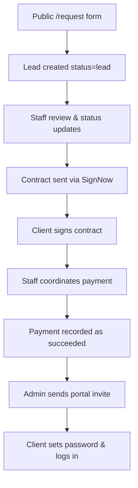

# Standard Operating Procedure (SOP): Family Onboarding, Contract, & Billing Lifecycle

**Version:** 1.1  
**Last Updated:** July 8, 2026  
**Audience:** Care Coordinators, Billing Ops, Admin Team  

**Objective:** Definitive guide to the end-to-end family lifecycle in Sokana CRM.

> **Important:** Sokana Collective does **not** use online/Stripe checkouts. All billing is handled through staff coordination, payment authorization forms, and QuickBooks. See [Technical Appendix: Legacy Code to Ignore](#5-technical-appendix-legacy-code-to-ignore) for deprecated Stripe references in the repo.

---

## 1. Workflow Overview



**Related docs:**

- Broader daily ops: [`PLATFORM_SOP.md`](./PLATFORM_SOP.md)
- Payment authorization API contract: [`BACKEND_PAYMENT_COLLECTION_RULES_PROMPT.md`](./BACKEND_PAYMENT_COLLECTION_RULES_PROMPT.md)
- Portal invite eligibility (frontend): [`../PORTAL_ELIGIBILITY_VERIFICATION.md`](../PORTAL_ELIGIBILITY_VERIFICATION.md)

---

## 2. Phase-by-Phase Execution

### Phase 1: Public Intake (`/request`)

- **What happens:** The family completes the 9-step public intake form (no login required).
- **Payment detail:** Step 7 (**Payment**) captures *only* their intended payment method (e.g., insurance, sliding scale, full support). **No credit card numbers are collected here.**
- **Support person:** Optional partner/family contact is captured on the Home Details step (step 2).
- **System action:** On submission, the backend creates a lead via `POST /requestService/requestSubmission` with `status: 'lead'` and `role: 'client'`.
- **Client outcome:** Thank-you screen. **No portal account is created.**

| Step | Title | Key data |
|------|-------|----------|
| 0 | Services Interested In | Service types, support details |
| 1 | Client Details | Name, email, phone, age, contact preferences |
| 2 | Home Details | Address, household, pets, optional support person |
| 3 | Referral | How they heard about Sokana |
| 4 | Health Information | Health history, allergies |
| 5 | Pregnancy/Baby | Due date, birth location, provider |
| 6 | Past Pregnancies | Previous pregnancy history |
| 7 | Payment | Payment **method** only (not a charge) |
| 8 | Client Demographics | Optional demographics |

---

### Phase 2: Staff CRM Lifecycle

Staff manually move the client through pipeline stages based on real-world interactions:

```
lead → contacted → interviewing / follow up → matched → contract → active → complete
```

| Status | Meaning |
|--------|---------|
| `lead` | New intake, not yet contacted |
| `contacted` | Outreach started |
| `interviewing` | Doula fit interview in progress |
| `follow up` | Awaiting client or internal action |
| `matched` | Ready for customer management; appears in **Customers** |
| `contract` | Contract being prepared, sent, or signed |
| `active` | Services started (contract + payment requirements met) |
| `complete` | Services finished |
| `not hired` | Did not convert |

**Staff actions at this stage:**

1. Open the lead in **Leads** or **Pipeline**.
2. Verify contact info, services, referral source, and payment pathway.
3. Add notes for outreach and internal handoffs.
4. Assign a doula when appropriate.
5. When status is set to **Matched**, the client appears in **Customers** and is synced to QuickBooks as a customer record (see Phase 4).

---

### Phase 3: Contract Generation (SignNow)

1. Navigate to the client record and open **Create Contract** (`EnhancedContractDialog`).
2. Configure service type, hours, rate, deposit, installments, and payment cadence.
3. Review calculated totals and payment schedule.
4. Click **Send Contract for Signature** — contract is sent via SignNow to the client's email.
5. Client signs digitally in SignNow.
6. Client may be redirected to **`/contract-signed`** — a confirmation page only (**no payment forms**).

**Contract signed in CRM:** The frontend reads `contract_status: 'signed'`, `has_signed_contract: true`, or a `contracts[]` entry with signed status from the backend (typically updated when SignNow completion is processed server-side).

---

### Phase 4: Payment Coordination & Recording

There is **no client-facing checkout** in the CRM. Staff coordinate and track payments based on the client's payment path:

| Payment path | Staff action required |
|--------------|----------------------|
| **Insurance / Private Pay** | Send the **Payment Authorization Form (PDF)**. When the client returns the signed PDF, click **Record payment authorization on file** in the lead profile. |
| **Self-Pay / Sliding Scale** | Coordinate directly via manual invoice, check, or external processor. Confirm payment in `/payments` once recorded by the backend. |
| **Full Support / Unable to pay** | No upfront payment or authorization form expected. Portal invite still requires backend eligibility (see below)—coordinate with admin if a waiver or $0 first payment must be recorded. |
| **Medicaid** | No card on file required; `payment_authorization_status` should be `not_required`. |

#### Staff controls in the lead profile

| Control | What it sets | Unlocks portal invite? |
|---------|--------------|------------------------|
| **Record payment authorization on file** | `payment_authorization_status: on_file`, `authorized_at` | **No** — billing readiness only |
| *(No CRM checkbox today)* | First payment `succeeded` | **Yes** (with signed contract) |

#### Tracking & systems used

- **`/payments`:** Admin dashboard for payment logs (`succeeded`, `pending`, `failed`).
- **`/billing/contracts`:** Billing ops view for contract schedules, overdue items, and follow-up emails.
- **QuickBooks (Admin nav):** When a client reaches **Matched**, the CRM syncs them to QuickBooks as a **customer** (`syncQuickBooksCustomerFromClient`). Payment status updates from paid invoices are handled by the **backend** (webhook or sync job)—confirm with backend/billing ops when `payment_status` flips to `succeeded`.

#### How "payment succeeded" is tracked

The **Invite** button unlocks when the backend reports the **first payment as succeeded**. The frontend checks:

- `payment_status === 'succeeded'`
- `has_completed_payment === true`
- `payments[]` containing an entry with `status: 'succeeded'`
- Backend override: `is_eligible === true` (preferred server-side computation)

This can happen via:

1. **QuickBooks sync / backend webhook** — when an invoice is marked paid in QuickBooks, the backend updates payment status (backend behavior; not driven by this frontend).
2. **Backend manual override** — admin or billing ops action on the server sets payment flags or `is_eligible: true` (confirm your backend workflow).

> **Do not confuse** "payment authorization on file" with "first payment succeeded." Authorization means staff can charge per your processes; portal invite requires the payment milestone separately.

For QuickBooks invoice deposits, portal invite may also require a **saved card token** on the customer profile. If the client paid but did not save their card, see [Edge Case: Client paid deposit but forgot to save card](#client-paid-deposit-but-forgot-to-save-card-quickbooks).

---

## 3. Unlocking Portal Access

Clients **cannot** self-register. Portal access is **admin-invited** after eligibility is met.

### Double gate (both required)

1. **Contract signed** — CRM shows contract as signed.
2. **First payment succeeded** — backend reports payment complete (or `is_eligible: true`).

The **Invite** button on the Clients table is enabled only when `isPortalEligible()` returns true (see `src/features/clients/utils/portalStatus.ts`).

### Portal status values

| Value | Meaning |
|-------|---------|
| `not_invited` | Eligible or not; no invite sent yet |
| `invited` | Invite email sent |
| `active` | Client has set password and logged in |
| `disabled` | Portal access revoked |

### Account creation flow

1. Staff clicks **Invite** → `POST /api/admin/clients/{id}/portal/invite` (body includes `frontend_url`).
2. Backend creates a Supabase user and emails a secure link to **`/auth/set-password`**.
3. Client sets password, then logs in at **`/auth/client-login`**.
4. Client accesses **`/`**, **`/profile`**, and **`/billing`**.

**Inside the portal (`/billing`):** Clients **cannot** enter credit card numbers. They can view/update insurance and billing details and download the Payment Authorization PDF to return to the care team.

Staff can **resend** or **disable** portal access via admin APIs from the Clients table.

---

## 4. Edge Cases

### 🚨 Client paid deposit but forgot to save card (QuickBooks)

That is the exact **gotcha** of online billing: the client successfully paid the deposit, but they did not check **“Save payment info.”** The invoice is marked closed/paid in QuickBooks, and you still do not have their card on file for the next installment.

Since you **cannot** ask them to pay the full deposit a second time, use the **$1.00 Account Verification** rescue protocol below.

#### What the system should do

When the backend webhook checks the paid invoice and sees **Stored Card ID = null**:

1. Record the payment as succeeded (deposit received).
2. Flag the client as **`Missing Card on File`** (or equivalent backend status).
3. Keep the **Portal Invite** button **locked** until a saved card token exists (unless admin overrides `is_eligible`).

#### The “Missed Checkbox” rescue protocol

**Step 1: Send the $1.00 “Account Sync” invoice**

Staff (or an automated trigger) creates a brand-new invoice in QuickBooks for **$1.00**:

- **Line item description:** *Secure Billing Account Tokenization & Verification*
- **Email message (template):** *Thank you for your deposit! To securely connect your card to our automated installment system and unlock your client portal, please pay this quick $1.00 verification link. **Crucial:** Please make sure to check the “Save card for future use” box this time!*

**Step 2: The client logs in and checks the box**

The client clicks the new link, enters card details, checks **Save card for future use**, and submits the $1.00 payment.

**Step 3: The double gate unlocks**

QuickBooks processes the single dollar, registers the card, tokenizes it to the customer profile, and fires a fresh webhook to the backend. The backend checks the profile, sees **Stored Card ID = present**, and the **Portal Invite** button unlocks for staff (assuming contract is also signed).

**Step 4: Credit the account (clean up)**

You now have a floating $1.00 from the client. Billing ops has two ways to keep the books clean:

| Option | Action |
|--------|--------|
| **A (easiest)** | Leave it on their account. When you generate the next real monthly installment, QuickBooks automatically applies that $1.00 as a credit, reducing their next bill by a dollar. |
| **B** | Staff hits **Refund** on that specific $1.00 transaction inside QuickBooks. The card **stays** saved on their profile even if you refund the dollar. |

#### Quick checklist (care coordinators & developers)

If a client pays their onboarding deposit but unchecks **“Save payment info”**:

1. The backend detects a successful payment but **no saved card token**.
2. The **Portal Invite** button **remains locked**; the lead status flags as **`Missing Card on File`**.
3. **Action required:** Staff issues a new QuickBooks invoice for **$1.00** labeled **Account Verification**.
4. Instruct the client via email/text to pay the $1.00 and check the **Save card** box.
5. Once the $1.00 payment processes with the card saved, the system automatically unlocks **Portal Invite**.
6. The $1.00 is applied as a credit toward their first official care installment (or refunded per Step 4 Option B).

This keeps billing automated and authorized for future installments, while turning a technical headache into a simple two-minute email fix.

---

## 5. Technical Appendix: Legacy Code to Ignore

Do not use, update, or reference the following for current operations. They belong to a **deprecated Stripe checkout** implementation that is not in production use:

| Item | Location |
|------|----------|
| `createPaymentIntent()` | `src/common/utils/createContract.ts` |
| Stripe payment page docs | `src/features/payments/ContractPayment.md` (superseded by this SOP) |
| Stripe workflow sections | `WORKFLOW_DIAGRAM.md`, `CONTRACT_AND_PAYMENT_INSTRUCTIONS.md` |
| Stripe charge backend prompt | `docs/BACKEND_BILLING_STRIPE_CHARGE_PROMPT.md` |

**Live payment model:** Payment authorization forms + staff billing ops + QuickBooks customer sync + CRM payment tracking (`/payments`, lead profile billing fields).

---

## 6. Quick Reference: Family Timeline

| # | Who | What happens |
|---|-----|--------------|
| 1 | Family | Submits `/request` form |
| 2 | Staff | Reviews lead, contacts client, updates status |
| 3 | Staff | Matches client to doula, moves to **Matched** |
| 4 | Staff | Creates and sends contract via SignNow |
| 5 | Client | Signs contract in SignNow; may see `/contract-signed` |
| 6 | Staff | Coordinates payment (PDF auth form, invoice, etc.) |
| 7 | Staff / Backend | Payment recorded as succeeded; auth on file if applicable |
| 8 | Admin | Sends portal **Invite** when double gate passes |
| 9 | Client | Sets password, logs in, uses profile/billing |

---

## 7. Key Frontend Files

| Area | Path |
|------|------|
| Public intake | `src/features/request/` |
| Client list & portal invite | `src/features/clients/Clients.tsx` |
| Lead profile & payment auth | `src/features/clients/components/dialog/LeadProfileModal.tsx` |
| Portal eligibility | `src/features/clients/utils/portalStatus.ts` |
| Contract wizard | `src/features/clients/components/dialog/EnhancedContractDialog.tsx` |
| Contract signed landing | `src/pages/ContractSignedPage.tsx` |
| Payment rules | `src/lib/paymentRules.ts` |
| Admin payments list | `src/features/financial/FinancialPage.tsx` |
| Billing portal | `src/features/billing-portal/` |
| QuickBooks customer sync | `src/common/utils/syncQuickBooksCustomer.ts` |
| Client portal auth | `src/features/auth/SetPassword.tsx`, `ClientLogin.tsx` |
| Client billing view | `src/features/client-dashboard/components/ClientProfileTab.tsx` |
